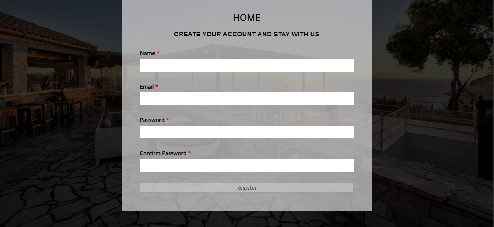
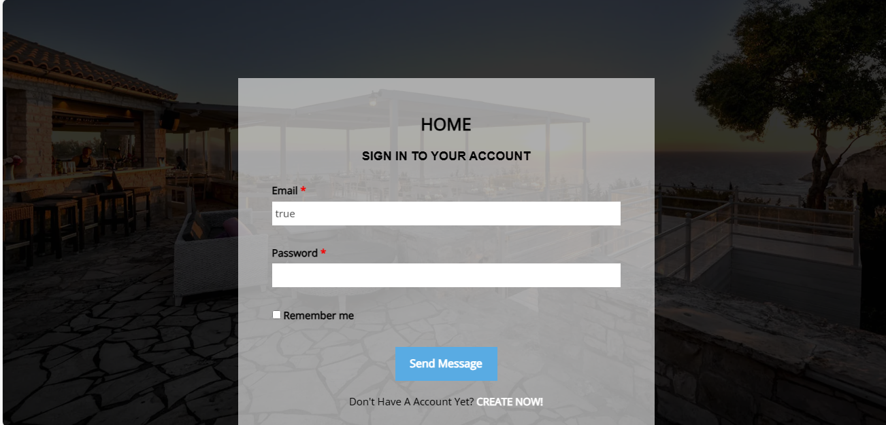
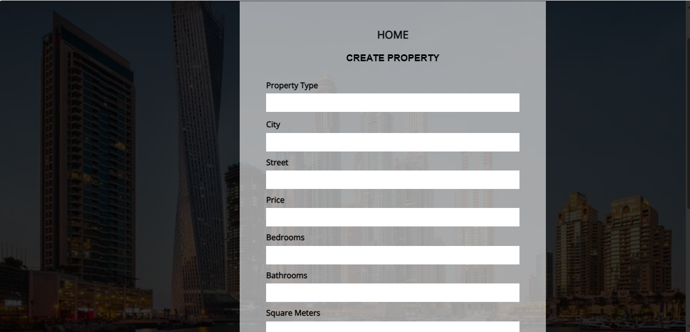

# ReactJS-Project

Msell Real Estate Project Documentation

Technologies Used

1. ReactJS
2. SoftUni Practice Server
3. CSS
4. React Router (for navigation)
5. Toast notifications library (react-toastify)
6. Map with leaflet

User Authentication

1. Register: Users can create accounts with a secure registration process.
2. Login: Authenticated users can log in securely.
3. Logout: Users can log out of their accounts.

The service is initialized with three users, which can be used for immediate testing:

1. peter@abv.bg : 123456
2. george@abv.bg : 123456
3. admin@abv.bg : admin

Property Management
1. Home Page ( about and service part)
2. Create Property: Authenticated users can list their properties for sale.
3. Edit Property: Users can modify property details.
4. Delete Property: Users can remove properties from the listing.

Comments
1. Add Comment: Authenticated users can leave comments on property listings.

Contact Page with Google Map
1. Contact Form: A contact form for users to reach out to the site administrator.
2. Google Map Integration: The contact page includes a Google Map to visualize the location.

Running the Project:
 npm run dev

Running the Server:
 node server.js

Project Structure

1. create my-project
2. HTML template
3. Component separation
4. Router

5. Add Register and Login Page

6. Update server
7. Add Create Page

8. Add navigation in Create page to Property list
9.Add Property Details
10. Add Comments
11. Add useForm and AuthContext
12. Add Navigation in Header and Menu 
13. Add Login form
14. Add Register form
15. Add Logout form
16. Add comments with username
17. Add edit and delete buttons
18. Add authentication for edin and delete buttons 
19. Add Persisted state
20. Add Edit page
21. Add Auth Guard
22. Add Latest Property
23. Add Map to Contact page

